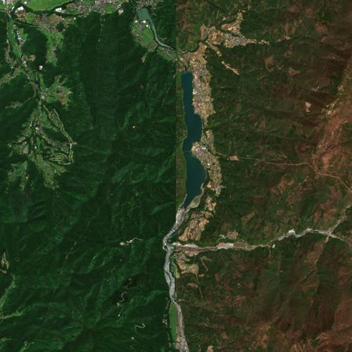
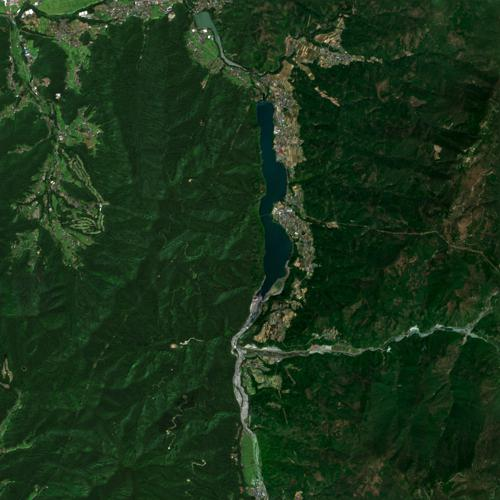

# Poisson Image Blending Remote Sensing Data
This project applies an image editing technique developed by [Pérez, Gangnet, and Blake](https://www.cs.jhu.edu/~misha/Fall07/Papers/Perez03.pdf) to remote sensing data. The core idea is to blend two, overlapping satellite images so that the seamlines between the images are completely invisible. To learn more about the technique, check out this [computer vision lecture by Rich Radke](https://www.youtube.com/watch?v=UcTJDamstdk).
 
## Run the code
You will need to install [Docker](https://www.docker.com/) and [Make](https://www.gnu.org/software/make/manual/make.html) on your system to get started. Run the following commands to blend the true-color Sentinel-2 input images located in the `./data/inputs` directory:

```sh
# Build the container image
make

# Run the Python code to blend the inputs
make run
```

Blended outputs will be saved to a newly created `./data/outputs` directory.

<p align="center">
  
  
</p>
<p align="center">
   <font size="2"> Naive copy-paste overlay of two different images on the left. Blended output on the right </font>
</p>

Try running the code with different inputs. Add any other pair of source/target true-color GeoTIFF files in a seperate directory inside of the `inputs` directory. Run the `make run` command and you will find a blended result in the `ouputs` folder.

